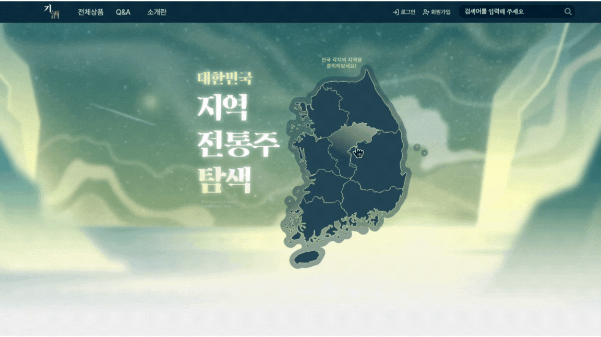
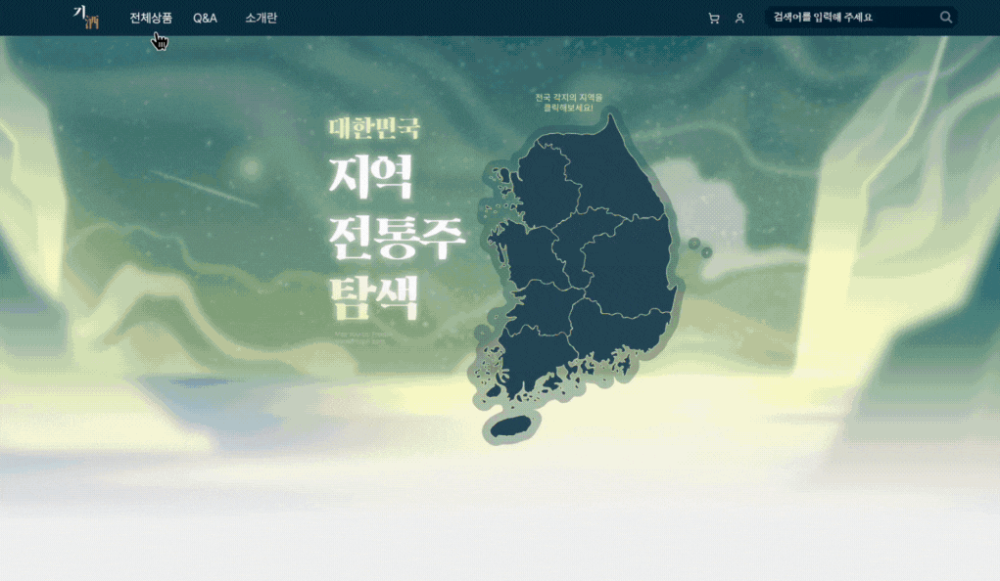
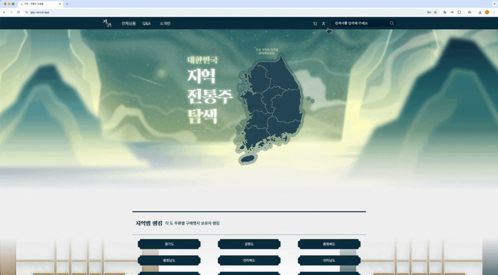

# 🥃(기주 이미지)

  

<h2 align="center">기주</h2>

**그대를 향해 술을 부치다**  
기주 온라인 주류 판매 사이트

---

## 📌 프로젝트 소개

기주는 온라인으로 다양한 전통주를 소개하고 판매하는 웹 플랫폼입니다.  
사용자는 회원가입 없이도 상품을 둘러볼 수 있으며, OAuth2(카카오) 로그인을 통해 간편하게 구매할 수 있습니다.  
안정적인 서버 아키텍처와 간편한 결제 시스템, 직관적인 UI를 통해 사용자에게 최적의 경험을 제공합니다.

---

## 👥 팀원

| Backend | Backend | Backend | Frontend |
|--------|--------|--------|---------|
|  |  |  |  |
| [김선준](https://github.com/kimseonj) | [김창환](https://github.com/hwan4338) | [최종빈](https://github.com/jongbinchoi) | [장인찬](https://github.com/JangInChan) |

---

## 💻 시연
| 지역 탐색 | 소셜 로그인 |
|-------------|--------------|
|  |  |

| 상품 페이지 | 랭킹 시스템 |
|--------|-------------|
|  |  |

| 결제 | 리뷰 작성 |
|--------------|--------------|
|  |  |

---

## 🛠️ 기술 스택

### 🔹 Backend

- **Language**: Java 21
- **Frameworks**: Spring Framework, Spring Boot 3.4.5
- **Database**: MySQL
- **ORM**: JPA
- **Deployment**: AWS EC2 (서버), AWS S3 (이미지 저장)
- **External API**:
  - 로그인: Kakao OAuth2
  - 결제: Toss Payments API
  - 지도: Kakao Map API

### 🔹 Frontend

- **Language**: TypeScript
- **Frameworks**: Next.js
- **Styling**: Tailwind CSS
- **Deployment**: Vercel

### 🔹 기타

- 협업 도구: Notion
- 디자인 툴: 피그마, 어도비 폰트

---

## 🏗️ 프로젝트 아키텍쳐

### ⚙️ 백엔드 구조  
 

---

### 🔁 CI/CD

---

### 💻 프론트 구조

> 이미지 삽입 예정  
`(여기에 프론트엔드 디렉토리 구조 이미지 또는 설명을 삽입할 예정입니다.)`

- Next.js 기반 서버 사이드 렌더링
- 페이지/컴포넌트 분리
- Tailwind CSS를 활용한 반응형 UI
- 카카오 지도 및 결제 API 연동

---
